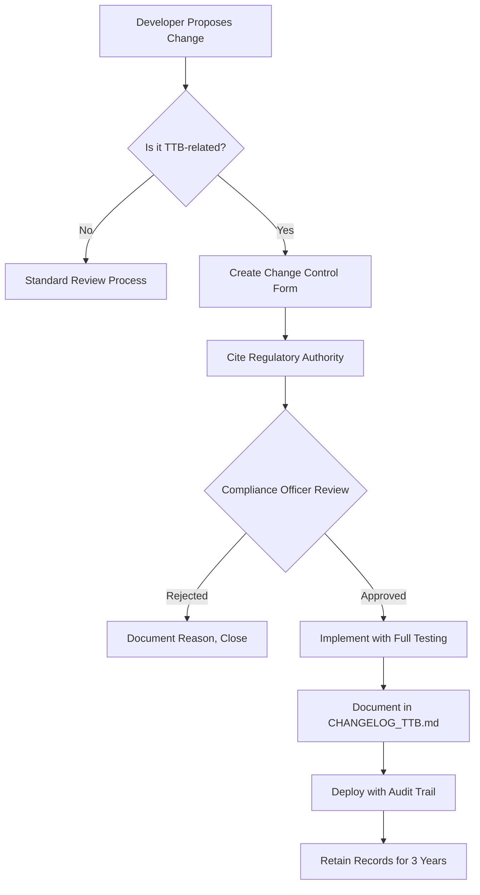

# TTB Audit & Change Control Procedures

**Purpose:** Maintain audit trail and change control for TTB compliance
**Last Updated:** 2025-11-28
**Regulatory Authority:** 27 CFR Part 19 Subpart V - Records and Reports
**Retention Period:** 3 years (TTB requirement)

---

## Table of Contents

1. [Audit Requirements](#audit-requirements)
2. [Change Control Policy](#change-control-policy)
3. [Document Retention](#document-retention)
4. [Audit Trail Logging](#audit-trail-logging)
5. [TTB Inspection Preparation](#ttb-inspection-preparation)
6. [Historical Data Integrity](#historical-data-integrity)
7. [Incident Response](#incident-response)

---

## Audit Requirements

### TTB Can Audit 3 Years Back

**Critical Fact:** The TTB can audit your records for **any month within the past 3 years**.

This means:
- All reports from 2022-2025 must be available on demand
- All supporting documentation must be retained
- All calculation methods must be documented
- All database changes must be logged

### What TTB Auditors Will Request

1. **Monthly Reports (Forms 5110.28, 5110.11, 5110.40)**
   - All submitted reports for audit period
   - Supporting calculations
   - Reconciliation worksheets

2. **Transaction Records**
   - Production records (batch sheets, fermentation logs)
   - Transfer documents (Form 5100.11)
   - Loss documentation (incident reports, angel's share calculations)
   - Tax determination records

3. **Inventory Records**
   - Daily/monthly inventory snapshots
   - Physical inventory counts
   - Reconciliation reports

4. **System Documentation**
   - How calculations are performed
   - Data model documentation
   - Change logs for any updates to calculation logic

---

## Change Control Policy

### What Requires Change Control

**ANY modification to:**

| Category | Examples | Approval Required |
|----------|----------|-------------------|
| **Calculation Logic** | Proof gallon formula, balance equation | Compliance Officer |
| **TTB Database Schema** | New columns, modified constraints | Database Admin + Compliance |
| **TTB Service Code** | TtbReportCalculatorService, TtbVolumeCalculator | Senior Developer + Compliance |
| **Constants** | STANDARD_BARREL_WINE_GALLONS, tolerance | Compliance Officer (with TTB citation) |
| **Transaction Types** | Adding/modifying TtbTransactionType enum | Compliance Officer |
| **Form Mappings** | Changes to TTB_FORM_5110_28_MAPPING.md | Compliance Officer |

### Change Control Process



### Change Control Form Template

```markdown
# TTB Change Control Request

**Date:** YYYY-MM-DD
**Requestor:** [Name]
**Change ID:** TTB-CHG-YYYYMMDD-###

## Proposed Change

**Summary:** [One sentence description]

**Affected Systems:**
- [ ] Database Schema
- [ ] Calculation Services
- [ ] API Endpoints
- [ ] Reports/PDFs
- [ ] Documentation

**Current Behavior:**
[Describe current implementation]

**Proposed Behavior:**
[Describe proposed change]

## Regulatory Justification

**TTB Authority:** [Cite 27 CFR section OR TTB ruling OR Industry Circular]

**Reason for Change:**
- [ ] TTB regulation changed
- [ ] Bug fix (calculation incorrect)
- [ ] Enhancement (new TTB form requirement)
- [ ] Audit finding remediation

**Impact Analysis:**
- Historical reports affected: [Yes/No - if yes, describe]
- Requires data migration: [Yes/No]
- Requires re-submission of past reports: [Yes/No]

## Testing Plan

- [ ] Unit tests updated
- [ ] Integration tests updated
- [ ] Regression tests pass
- [ ] Manual validation completed
- [ ] Test results attached

## Approval

**Compliance Officer:** _____________________ Date: _______
**Senior Developer:** _____________________ Date: _______
**Database Admin:** _____________________ Date: _______ (if schema change)

## Post-Implementation

**Deployed:** YYYY-MM-DD HH:MM UTC
**Git Commit:** [commit hash]
**Documented in:** CHANGELOG_TTB.md
**Audit Trail:** [Link to audit log entry]
```

### TTB-Specific Changelog

**File:** `CHANGELOG_TTB.md` (in repository root)

```markdown
# TTB Compliance Changelog

All changes to TTB-related code, calculations, or documentation.

## [2024-01-15] - Change ID: TTB-CHG-20240115-001

### Changed
- Updated `TtbVolumeCalculator.CalculateProofGallons()` rounding from `AwayFromZero` to `ToEven`

### Regulatory Authority
- 27 CFR 19.1 - Proof gallon definition
- TTB Industry Circular 2024-01

### Impact
- Affects proof gallon calculations by ≤ 0.01 PG
- No impact on historical reports (within tolerance)

### Testing
- Regression tests pass: ✅
- Manual validation: ✅
- Approved by: [Compliance Officer Name]

### Files Changed
- `Caskr.Server/Services/TtbVolumeCalculator.cs`

### Git Commit
- `abc123def456` - "Update proof gallon rounding per TTB Circular 2024-01"
```

---

## Document Retention

### What to Retain (3 Years Minimum)

| Document Type | Retention Period | Storage Location | Format |
|---------------|------------------|------------------|--------|
| **Monthly Reports (5110.28)** | 3 years | `/TTB_Compliance/Reports/{YYYY}/{MM}/` | PDF + JSON data |
| **Supporting Calculations** | 3 years | `/TTB_Compliance/Calculations/{YYYY}/{MM}/` | Excel/CSV |
| **Transaction Logs** | 3 years | Database + backup | PostgreSQL |
| **Inventory Snapshots** | 3 years | Database + backup | PostgreSQL |
| **Transfer Documents** | 3 years | `/TTB_Compliance/Transfers/{YYYY}/` | PDF |
| **Loss Documentation** | 3 years | `/TTB_Compliance/Losses/{YYYY}/` | PDF + photos |
| **Reconciliation Reports** | 3 years | `/TTB_Compliance/Reconciliations/{YYYY}/Q{Q}/` | Excel |
| **Change Control Forms** | 3 years | `/TTB_Compliance/ChangeControl/{YYYY}/` | PDF |
| **Audit Findings** | Permanent | `/TTB_Compliance/Audits/{YYYY}/` | PDF |

### File Naming Convention

```
{DocumentType}_{CompanyID}_{YYYY-MM-DD}_{Description}.{ext}

Examples:
- MonthlyReport_001_2024-01-31_Form5110.28.pdf
- Reconciliation_001_2024-Q1_PhysicalInventory.xlsx
- ChangeControl_TTB-CHG-20240115-001_ProofGallonRounding.pdf
- Loss_001_2024-02-15_BarrelBreakage_Rickhouse3.pdf
```

### Backup Requirements

**Daily Backups:**
- `ttb_transactions` table
- `ttb_inventory_snapshots` table
- `ttb_monthly_reports` table

**Retention:**
- Daily backups: 30 days
- Monthly backups: 3 years
- Annual backups: Permanent (for historical reference)

**Verification:**
```bash
#!/bin/bash
# Verify TTB data backup integrity

# Check backup exists
if [ ! -f "/backups/ttb_data_$(date +%Y-%m-%d).sql.gz" ]; then
    echo "❌ ERROR: TTB backup missing for $(date +%Y-%m-%d)"
    exit 1
fi

# Verify backup integrity
gunzip -t "/backups/ttb_data_$(date +%Y-%m-%d).sql.gz"
if [ $? -ne 0 ]; then
    echo "❌ ERROR: TTB backup corrupted for $(date +%Y-%m-%d)"
    exit 1
fi

echo "✅ TTB backup verified for $(date +%Y-%m-%d)"
```

---

## Audit Trail Logging

### Database Audit Triggers

**Create audit log table:**

```sql
CREATE TABLE IF NOT EXISTS ttb_audit_log (
    id BIGSERIAL PRIMARY KEY,
    table_name VARCHAR(100) NOT NULL,
    record_id BIGINT NOT NULL,
    operation VARCHAR(20) NOT NULL,  -- INSERT, UPDATE, DELETE
    old_values JSONB NULL,
    new_values JSONB NOT NULL,
    changed_by_user_id INTEGER,
    changed_at TIMESTAMPTZ DEFAULT NOW() NOT NULL,
    change_reason TEXT,
    ip_address VARCHAR(50),
    session_id VARCHAR(100)
);

CREATE INDEX idx_ttb_audit_table_record ON ttb_audit_log(table_name, record_id);
CREATE INDEX idx_ttb_audit_timestamp ON ttb_audit_log(changed_at DESC);
CREATE INDEX idx_ttb_audit_user ON ttb_audit_log(changed_by_user_id);
```

**Audit trigger for ttb_transactions:**

```sql
CREATE OR REPLACE FUNCTION audit_ttb_transactions()
RETURNS TRIGGER AS $$
BEGIN
    IF TG_OP = 'INSERT' THEN
        INSERT INTO ttb_audit_log (table_name, record_id, operation, new_values)
        VALUES ('ttb_transactions', NEW.id, 'INSERT', row_to_json(NEW));
        RETURN NEW;
    ELSIF TG_OP = 'UPDATE' THEN
        INSERT INTO ttb_audit_log (table_name, record_id, operation, old_values, new_values)
        VALUES ('ttb_transactions', NEW.id, 'UPDATE', row_to_json(OLD), row_to_json(NEW));
        RETURN NEW;
    ELSIF TG_OP = 'DELETE' THEN
        INSERT INTO ttb_audit_log (table_name, record_id, operation, old_values, new_values)
        VALUES ('ttb_transactions', OLD.id, 'DELETE', row_to_json(OLD), '{}');
        RETURN OLD;
    END IF;
END;
$$ LANGUAGE plpgsql;

CREATE TRIGGER ttb_transactions_audit
AFTER INSERT OR UPDATE OR DELETE ON ttb_transactions
FOR EACH ROW EXECUTE FUNCTION audit_ttb_transactions();
```

### Application-Level Audit Logging

**Service:** `TtbAuditLogger.cs`

```csharp
public interface ITtbAuditLogger
{
    Task LogCalculationAsync(string operation, object inputData, object result, int userId);
    Task LogReportGenerationAsync(int companyId, int month, int year, int userId);
    Task LogReportSubmissionAsync(int reportId, string ttbConfirmation, int userId);
}

public class TtbAuditLogger : ITtbAuditLogger
{
    public async Task LogCalculationAsync(string operation, object inputData, object result, int userId)
    {
        var logEntry = new TtbAuditLog
        {
            TableName = "calculation",
            Operation = operation,
            NewValues = JsonSerializer.Serialize(new { inputData, result }),
            ChangedByUserId = userId,
            ChangeReason = $"TTB Calculation: {operation}"
        };

        await _context.TtbAuditLogs.AddAsync(logEntry);
        await _context.SaveChangesAsync();
    }
}
```

### Audit Log Queries

**Find all changes to a specific report:**

```sql
SELECT
    changed_at,
    operation,
    changed_by_user_id,
    old_values->>'proof_gallons' AS old_proof_gallons,
    new_values->>'proof_gallons' AS new_proof_gallons,
    change_reason
FROM ttb_audit_log
WHERE table_name = 'ttb_monthly_reports'
  AND record_id = 123
ORDER BY changed_at DESC;
```

**Find who modified TTB calculations in January 2024:**

```sql
SELECT
    DATE(changed_at) AS change_date,
    u.username,
    COUNT(*) AS change_count,
    STRING_AGG(DISTINCT operation, ', ') AS operations
FROM ttb_audit_log al
JOIN users u ON u.id = al.changed_by_user_id
WHERE table_name LIKE 'ttb_%'
  AND changed_at >= '2024-01-01'
  AND changed_at < '2024-02-01'
GROUP BY DATE(changed_at), u.username
ORDER BY change_date, change_count DESC;
```

---

## TTB Inspection Preparation

### 30-Day Preparation Checklist

**When you receive a TTB inspection notice:**

#### Week 1: Document Gathering

- [ ] Pull all monthly reports for audit period (typically 12-36 months)
- [ ] Generate supporting calculations for each month
- [ ] Print reconciliation reports (quarterly)
- [ ] Locate all transfer documents (Form 5100.11)
- [ ] Compile loss documentation with photos/incident reports
- [ ] Create audit binder with table of contents

#### Week 2: System Validation

- [ ] Run regression test suite (confirm all tests pass)
- [ ] Manually validate 3 random months against source data
- [ ] Verify database integrity (no orphaned records)
- [ ] Check all formulas match documentation
- [ ] Review audit trail logs for anomalies

#### Week 3: Documentation Review

- [ ] Update `TTB_FORM_5110_28_MAPPING.md` if stale
- [ ] Verify `CHANGELOG_TTB.md` is complete
- [ ] Print system architecture diagram
- [ ] Document all integrations (accounting, etc.)
- [ ] Prepare "How Our System Works" presentation

#### Week 4: Final Preparation

- [ ] Conduct mock audit with compliance officer
- [ ] Prepare workspace for auditor (desk, power, WiFi)
- [ ] Notify IT to enable read-only auditor account
- [ ] Brief key personnel on audit protocol
- [ ] Have legal counsel on standby

### Inspection Day Protocol

**Do:**
- ✅ Be cooperative and professional
- ✅ Answer questions honestly and directly
- ✅ Provide requested documents promptly
- ✅ Take notes of all questions and requests
- ✅ Have compliance officer present for all discussions

**Don't:**
- ❌ Volunteer information beyond what's requested
- ❌ Make promises you can't keep
- ❌ Alter any records after inspection notice
- ❌ Allow unsupervised access to production systems
- ❌ Sign anything without legal counsel review

### Post-Inspection

**Within 7 days:**

1. **Document findings**
   - Create inspection report
   - List all findings (positive and negative)
   - Identify root causes of any deficiencies

2. **Create remediation plan**
   - For each finding, document corrective action
   - Assign owner and deadline
   - Track in issue tracker with "TTB-Audit" label

3. **Implement fixes**
   - Follow change control process
   - Test thoroughly
   - Document in CHANGELOG_TTB.md

4. **Follow up with TTB**
   - Submit remediation plan (if required)
   - Provide evidence of fixes
   - Request confirmation of closure

---

## Historical Data Integrity

### Immutability Requirements

**TTB Data Should Be Append-Only:**

Once a monthly report is submitted, the underlying data should be **immutable**.

```csharp
// ❌ BAD: Allows modifying historical data
public async Task UpdateTransaction(int id, decimal newProofGallons)
{
    var transaction = await _context.TtbTransactions.FindAsync(id);
    transaction.ProofGallons = newProofGallons;  // Destroys audit trail!
    await _context.SaveChangesAsync();
}

// ✅ GOOD: Creates adjustment transaction
public async Task AdjustTransaction(int originalId, decimal adjustmentAmount, string reason)
{
    var adjustment = new TtbTransaction
    {
        TransactionType = TtbTransactionType.Gain,  // or Loss if negative
        ProofGallons = adjustmentAmount,
        Notes = $"Adjustment to transaction {originalId}: {reason}",
        OriginalTransactionId = originalId  // Link to original
    };
    await _context.TtbTransactions.AddAsync(adjustment);
    await _context.SaveChangesAsync();
}
```

### Data Migration Safety

**If you must migrate historical data:**

```sql
-- 1. Create backup table
CREATE TABLE ttb_transactions_backup_20240115 AS
SELECT * FROM ttb_transactions;

-- 2. Perform migration with full logging
INSERT INTO ttb_audit_log (table_name, operation, change_reason, new_values)
SELECT
    'ttb_transactions',
    'DATA_MIGRATION',
    'Migration from legacy system - Change Control TTB-CHG-20240115-001',
    row_to_json(t.*)
FROM ttb_transactions t;

-- 3. Verify row counts match
SELECT COUNT(*) FROM ttb_transactions_backup_20240115;
SELECT COUNT(*) FROM ttb_transactions;

-- 4. Spot check random samples
SELECT * FROM ttb_transactions_backup_20240115 ORDER BY RANDOM() LIMIT 10;
SELECT * FROM ttb_transactions WHERE id IN (...);

-- 5. Document migration in permanent log
INSERT INTO ttb_data_migrations (
    migration_id,
    description,
    executed_at,
    rows_affected,
    approved_by,
    verification_status
) VALUES (
    'TTB-MIG-20240115-001',
    'Migrate transactions from legacy system',
    NOW(),
    (SELECT COUNT(*) FROM ttb_transactions),
    'Compliance Officer Name',
    'VERIFIED'
);
```

---

## Incident Response

### Incident Types

| Severity | Definition | Response Time | Escalation |
|----------|------------|---------------|------------|
| **Critical** | Submitted report has calculation error | 1 hour | CEO, Legal, TTB |
| **High** | Pre-submission validation failure | 4 hours | Compliance Officer |
| **Medium** | Data discrepancy in non-submitted report | 1 business day | Compliance Officer |
| **Low** | Documentation missing, no impact on reports | 1 week | Team Lead |

### Critical Incident: Submitted Report Error

**Scenario:** You submitted Form 5110.28 for January 2024, and later discovered proof gallons were calculated incorrectly.

**Response Protocol:**

1. **Immediate Actions (Hour 1)**
   - [ ] Stop all further TTB submissions
   - [ ] Notify compliance officer and legal counsel
   - [ ] Assemble incident response team
   - [ ] Preserve all evidence (database snapshots, logs)

2. **Assessment (Hours 2-4)**
   - [ ] Identify root cause of error
   - [ ] Determine scope (how many months affected?)
   - [ ] Calculate magnitude of error (proof gallons difference)
   - [ ] Assess legal/financial impact

3. **TTB Notification (Day 1)**
   - [ ] Draft notification letter to TTB
   - [ ] Legal counsel review
   - [ ] Submit via certified mail + email
   - [ ] Request meeting with TTB officer

4. **Remediation (Week 1)**
   - [ ] Fix calculation bug (follow change control)
   - [ ] Re-calculate all affected reports
   - [ ] Prepare amended submissions
   - [ ] Submit corrected reports to TTB

5. **Post-Incident (Week 2)**
   - [ ] Root cause analysis document
   - [ ] Implement preventive controls
   - [ ] Update testing procedures
   - [ ] Train team on lessons learned
   - [ ] Document in permanent incident log

### Incident Log Template

```markdown
# TTB Incident Report

**Incident ID:** TTB-INC-YYYYMMDD-###
**Date Discovered:** YYYY-MM-DD HH:MM UTC
**Severity:** [Critical / High / Medium / Low]

## Summary

[One paragraph description of what went wrong]

## Impact

**Reports Affected:** [List report months]
**Data Affected:** [Production / Transfers / Losses / etc.]
**Error Magnitude:** [X proof gallons, Y% deviation]
**Financial Impact:** [$X in potential penalties/taxes]

## Root Cause

**Technical Cause:**
[What code/configuration was wrong]

**Process Cause:**
[Why did our checks not catch this]

## Timeline

- YYYY-MM-DD HH:MM - Error introduced (commit hash)
- YYYY-MM-DD HH:MM - Report submitted to TTB
- YYYY-MM-DD HH:MM - Error discovered
- YYYY-MM-DD HH:MM - Incident response initiated
- YYYY-MM-DD HH:MM - TTB notified
- YYYY-MM-DD HH:MM - Fix deployed
- YYYY-MM-DD HH:MM - Corrected reports submitted

## Resolution

**Fix Applied:**
[Description of technical fix]

**Verification:**
[How we confirmed the fix works]

**Preventive Measures:**
1. [New test added]
2. [New validation check]
3. [Documentation updated]

## Lessons Learned

[What we learned and how we'll prevent recurrence]

## Approvals

**Incident Commander:** _____________________ Date: _______
**Compliance Officer:** _____________________ Date: _______
**Legal Counsel:** _____________________ Date: _______
```

---

## Access Control

### Who Can Modify TTB Data

| Role | Read | Create | Update | Delete | Submit Reports |
|------|------|--------|--------|--------|----------------|
| **Production Staff** | Own company | ✅ | ❌ | ❌ | ❌ |
| **Operations Manager** | Own company | ✅ | ✅ (current month) | ❌ | ❌ |
| **Compliance Officer** | All companies | ✅ | ✅ | ❌ | ✅ |
| **System Admin** | All companies | ✅ | ✅ (with justification) | ❌ | ❌ |
| **Auditor (Read-Only)** | Assigned companies | ✅ | ❌ | ❌ | ❌ |

### Database Permissions

```sql
-- Create role for compliance officer
CREATE ROLE ttb_compliance;
GRANT SELECT, INSERT, UPDATE ON ttb_transactions TO ttb_compliance;
GRANT SELECT, INSERT, UPDATE ON ttb_inventory_snapshots TO ttb_compliance;
GRANT SELECT, INSERT, UPDATE ON ttb_monthly_reports TO ttb_compliance;

-- Create role for auditor (read-only)
CREATE ROLE ttb_auditor;
GRANT SELECT ON ttb_transactions TO ttb_auditor;
GRANT SELECT ON ttb_inventory_snapshots TO ttb_auditor;
GRANT SELECT ON ttb_monthly_reports TO ttb_auditor;
GRANT SELECT ON ttb_audit_log TO ttb_auditor;

-- No role should have DELETE permission on TTB tables
REVOKE DELETE ON ttb_transactions FROM PUBLIC;
```

---

## Annual Compliance Review

### Annual Checklist (Every January)

- [ ] Review all 12 monthly reports from previous year
- [ ] Verify all reports were submitted on time
- [ ] Check for any outstanding TTB correspondence
- [ ] Update compliance documentation for regulation changes
- [ ] Conduct training for new staff on TTB procedures
- [ ] Test disaster recovery for TTB data
- [ ] Review and renew compliance officer certification
- [ ] Archive previous year's documents
- [ ] Update retention policy if regulations changed

---

## Resources

- **TTB Regulations:** [27 CFR Part 19](https://www.ecfr.gov/current/title-27/chapter-I/subchapter-A/part-19)
- **TTB Industry Circulars:** [https://www.ttb.gov/regulations-and-rulings/industry-circulars](https://www.ttb.gov/regulations-and-rulings/industry-circulars)
- **TTB Contact:** [https://www.ttb.gov/contact](https://www.ttb.gov/contact)
- **Caskr Compliance Docs:** `docs/TTB_*.md`

---

**Document Version:** 1.0
**Next Review Date:** 2026-01-01 (annual)
**Retention Period:** Permanent (compliance reference document)
